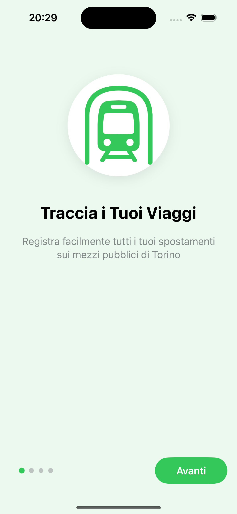
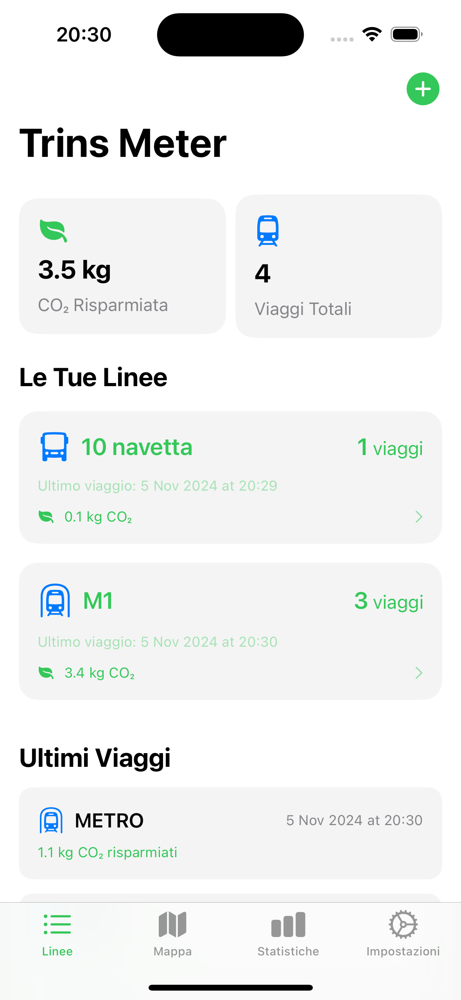
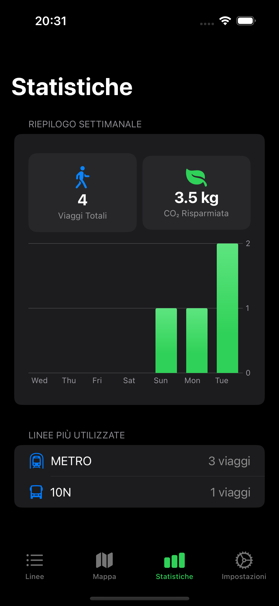

# TrinsMeter 🚊

TrinsMeter is an elegant iOS app that helps you track your public transportation usage in Turin and calculate your CO₂ savings. Built with SwiftUI and focused on providing a beautiful, intuitive user experience.

## Features ✨

- **Track Your Rides**: Easily log your trips on Turin's public transport network
- **CO₂ Impact**: See how much CO₂ you're saving by choosing public transport
- **Real-time Map**: View Turin's public transport network in real-time
- **Smart Defaults**: Set your common routes for quick logging
- **Beautiful Stats**: Visualize your impact with elegant charts and statistics
- **Dark Mode**: Full support for both light and dark themes
- **Offline Support**: Cache system for lines and stops data

## Technical Details 🛠

- Built with SwiftUI and SwiftData
- Follows Apple's Human Interface Guidelines
- Uses GTT (Turin Transport Company) official API
- Implements MVVM architecture
- Features elegant animations and haptic feedback

## Contributing 🤝

Contributions are welcome! Here's how you can help:

1. Fork the repository
2. Create your feature branch (`git checkout -b feature/AmazingFeature`)
3. Commit your changes (`git commit -m 'Add some AmazingFeature'`)
4. Push to the branch (`git push origin feature/AmazingFeature`)
5. Open a Pull Request

### Areas for Contribution

- [ ] Add support for more transport types
- [ ] Implement journey planning
- [ ] Add widgets support
- [ ] Improve accessibility features
- [ ] Add localization for more languages
- [ ] Implement Apple Watch companion app

## License 📄

This project is licensed under the MIT License - see the [LICENSE](LICENSE) file for details.

## Acknowledgments 🙏

- GTT Torino for providing the transport data
- [trins.it](https://trins.it) for the API support
- All the contributors who help make this project better

## Contact 📫

Paolo Dionesalvi - [@mrdionesalvi](https://github.com/mrdionesalvi)

---

  Made with ❤️ in Turin

